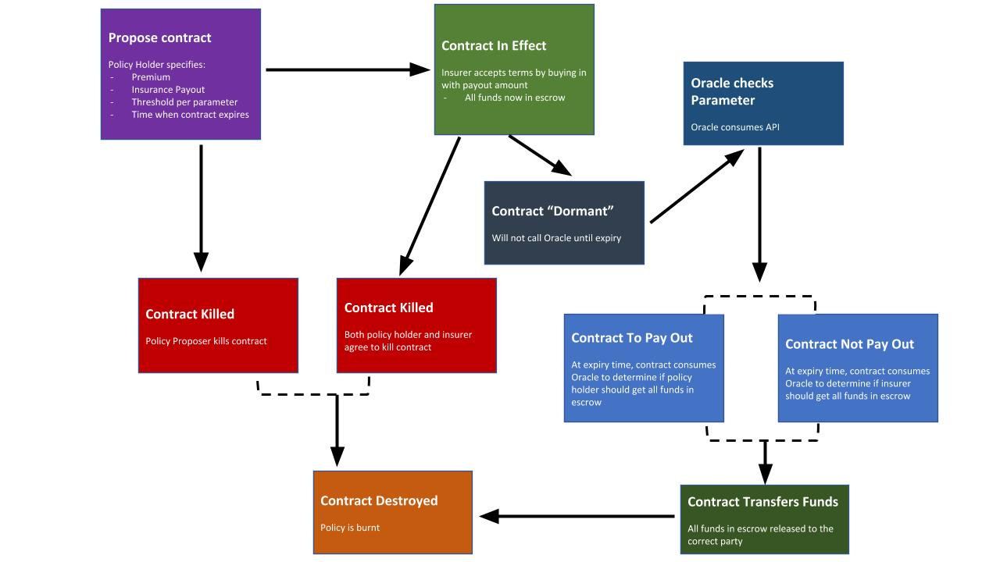

# Provable Insurance Ethereum Smart Contract

## Description
The contract is built with [Solidity](https://solidity.readthedocs.io/en/v0.5.13/), which is deployed to the [Ropsten](https://ropsten.etherscan.io/) network with [Truffle](https://www.trufflesuite.com/truffle), [HDWalletProvider](https://github.com/trufflesuite/truffle-hdwallet-provider), and [Infura](http://Infura.io/).  The contract is also [Oraclized/Provable](https://provable.xyz/), consuming weather data about [temperature](https://openweathermap.org/api).
The front-end that interacts with the contract using [OneClickDapp](http://oneclickdapp.com).


## Overview


## Install
* Install [Metamask](https://metamask.io) for Chrome.
* Install [Node.js and npm](https://nodejs.org/en/) (or with brew below)
```
cd /PATH/TO/YOUR/FOLDER/final-project-contract
brew install node
npm install truffle -g
npm install @truffle/hdwallet-provider
```
## Modify Project
### In ```truffle-config.js```:
Replace the values in the following lines with your [MetaMask private key](https://metamask.zendesk.com/hc/en-us/articles/360015289632-How-to-Export-an-Account-Private-Key) and [Infura Project ID](https://infura.io/dashboard).
```
const mnemonic = "{YOUR-METAMASK-PRIVATE-KEY}";
...
return new HDWalletProvider(mnemonic, "https://ropsten.infura.io/v3/{YOUR-INFURA-PROJECT-ID}")
```
### In ```Insurance.sol```:
Replace the values in the following lines with your [Open Weather Map API Key](https://openweathermap.org/).
```
string APIKEY = "{YOUR-API-KEY}";
```

## Run
```
cd /PATH/TO/YOUR/FOLDER/final-project-contract
truffle compile
truffle migrate --network ropsten --reset
```
Then, you will find the "contract address" for the file ```2_deploy_contracts.js``` and copy it. In [OneClickDapp](https://oneclickdapp.com/new/), paste the contract address into *Address*, select Ropsten for *Network*, and copy the contents of ```.../final-project-contract/abi.json``` into the *Interface ABI* section.

**Note:** Copy and paste the contents of the solidity contract ```Insurance.sol``` into a new soliditity file in [Remix](https://remix.ethereum.org/), an online solidity IDE and compiler.

## Demo
* You can find a demo of an example contract deployed to ropsten and a frontend [here](https://oneclickdapp.com/nylon-episode/)
* Demo is hosted by **[OneClickDapp](https://oneclickdapp.com)**